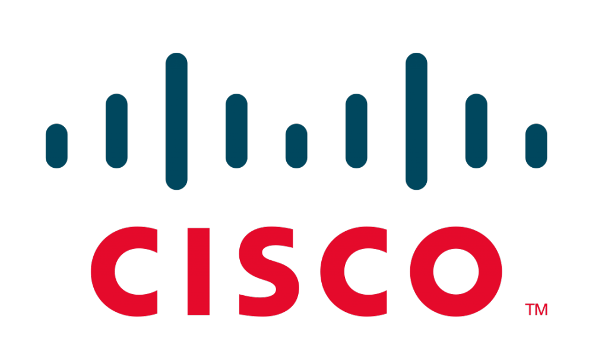
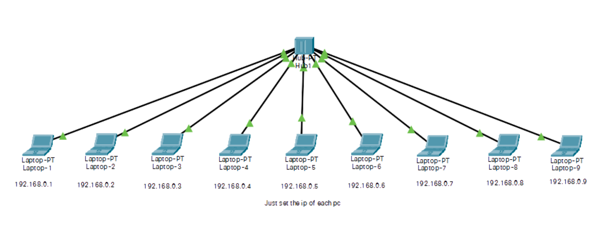
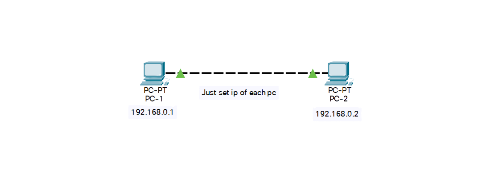
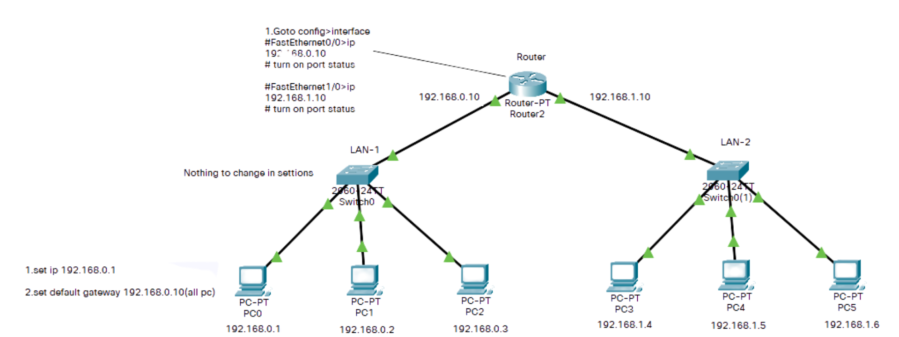
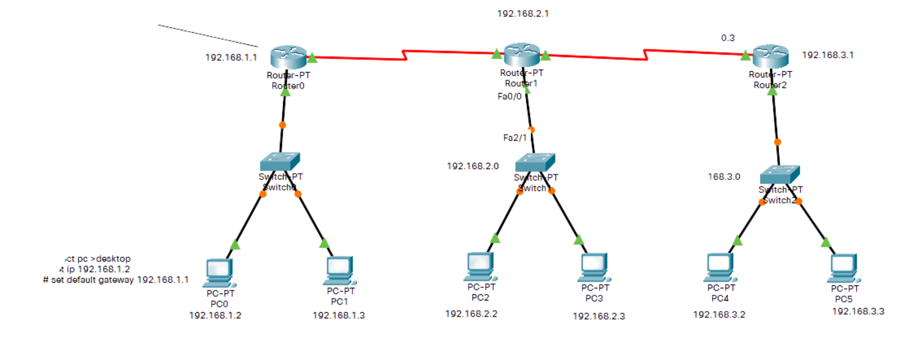
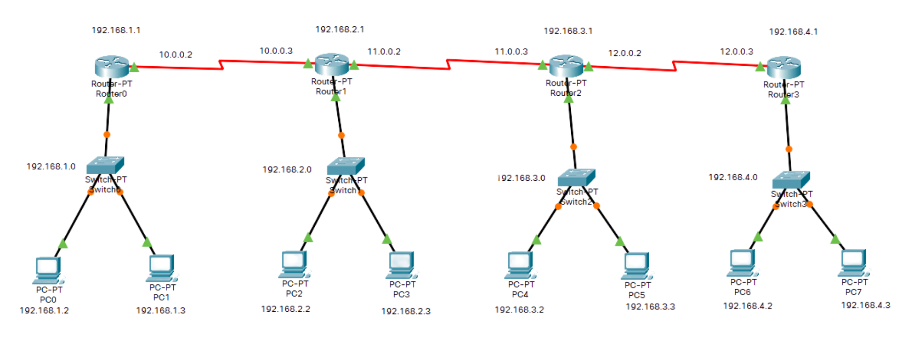
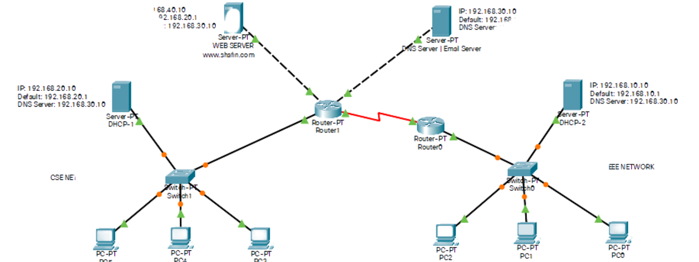
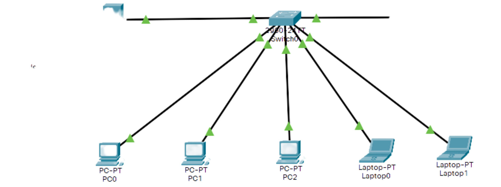
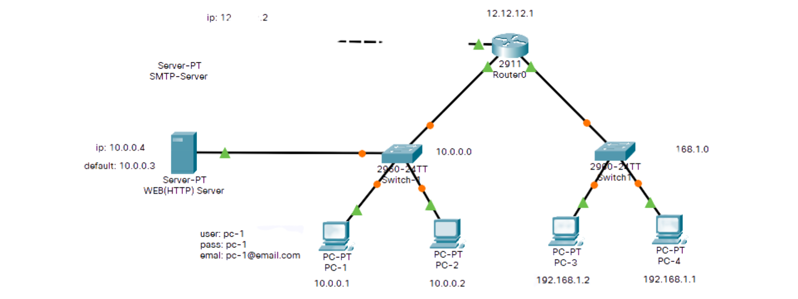

    

  <h2 align="center">Computer Networking Projects</h2>

- #### Cisco Packet Tracer
- #### Version: 8.0.1.0064

## About this project

This repository contains some network simulations for simple and complex network practice project for University Computer Network course.

- #### [1 Hub + 9 PC](https://)

    

- #### [1 PC + 1 PC](https://)

    

- #### [1 Router + 2 Lan + 6 PC](https://)

    

- #### [3 Router + 3 Switch + 6 PC](https://)

    

- #### [4 Router + 4 Switch + 8 PC](https://)

    

- #### [DHCP + (EMAIL+DNS) + WEB Server](https://)

    

- #### [DHCP + 1 Switch + 1 Router + 4 PC](https://)

    

- #### [DNS + (EMAIL+DHCP) Server](https://)

    

- #### [SMTP + Web Server](https://)

    

    <b><a href="#">↥ Back To Top</a></b>

